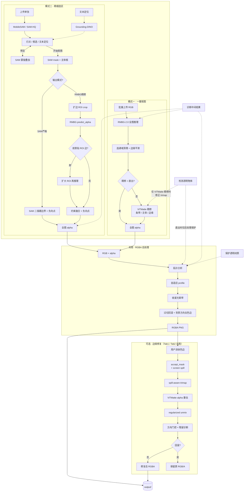

# 全自动抠图工具

本地离线抠图工作站：一键批量 + SAM 精细选区，可直接 `python app.py`，打包后双击 exe 即用，数据不出本机。

## 功能特性

- **离线本地 + 绿色免安装** — 全链路本机推理，无需联网、无需上传云端；打包后无需依赖即可运行
- **一键批量抠图** — 多图拖入，自动识别主体，输出透明 PNG 到 `output/`
- **文本定位 + 精细选区** — 正负向点选/框选，蒙版实时预览；可选中英文描述自动框物（Grounding-DINO → SAM），支持继续加点修正；MobileSAM（快）/ SAM-HQ（高精）双引擎
- **多模型融合** — 精细模式默认 SAM 定主体 + RMBG 在 ROI 内约束融合生成软 alpha；也可选 SAM 严格二值硬边界快速导出；批量模式 RMBG 全图，可选 ViTMatte 精修软边（大部分情况效果不如直出）
- **涂抹式边缘修复** — 一键抠图 / 精细选区完成后均可进入修复模式：ViTMatte 重估高 alpha 发丝、regularized unmix 去色边；支持绿/蓝/红/黄/青/品红等纯色幕布的 screen chroma 诊断与回滚保护
- **结果导出** — 两 Tab 预览区均支持「查看大图」与「下载」透明 PNG；修复结果另存为 `output/refined*.png`
- **原图中栏** — 两 Tab 中栏均支持点击上传与 **Ctrl+V 粘贴**剪贴板图片；换图须先点「清空原图区」（预览显示后上传入口会从页面卸载，无法直接覆盖）
- **显存管理** — 模型按需加载、用完可卸，减轻显卡压力；默认适合单人使用、尽量省显存；多人同时开多个浏览器页时，每人选区分开保存，并限制「同时处理几张」和排队人数，避免显卡一次占满

## 功能说明

### 处理流程

两条路径各自得到全图 alpha，**导出 PNG 前**共用同一套 RGBA 后处理（`engines/rgba_postprocess`）。启动时默认后台预热 RMBG-2.0（`MATTING_PRELOAD_RMBG=0` 可关闭）。



**读图说明**

- 模式一 **直出**：RMBG → 清理/平滑 → 后处理；不跑 ViTMatte，也不调用 Grounding-DINO。
- 模式一 **ViTMatte 精修**：在 RMBG alpha 上内部生成窄 unknown trimap 再精修；若同时勾选「检测透明物体」，DINO 用于修正 trimap（非直出路径）。
- 模式一勾选「检测透明物体」且为直出时：仅在后处理阶段加强半透明保护，**不跑 DINO 检测**。
- 模式二 **不走 ViTMatte**；输出二选一：**SAM严格**（纯 SAM 二值硬边界，不调 RMBG，最快）或 **RMBG精修**（SAM 定主体，ROI 内 RMBG + 约束融合，默认推荐）。低显存下 SAM-HQ 与 RMBG 可能同时驻留，建议 ≥8GB 显存或优先 MobileSAM。
- 两种模式导出前都会走自动 RGB 去色边：使用 alpha 外侧背景 seed 估计局部背景方向，只在背景可信且边缘确有背景色残留时修正；透明保护区与细节区保持保守。
- 默认 **单 session 低显存**；多人/多标签页加 `--multi-session`（每页独立 SAM predictor / embedding / 点击先验，SAM 会话 LRU，默认最多 8 个）。

### 原图上传（两 Tab 中栏）

- **点击上传** 或 **Ctrl+V 粘贴**（焦点需在页面内、且不在文本输入框中）
- 上传/粘贴成功后在中栏显示原图预览；**更换图片须先点「清空原图区」** 再重新上传或粘贴
- 一键抠图可选 **单张** / **批量**：单张支持粘贴；批量为多文件选择（不支持粘贴）

### 模式一：一键抠图

1. 打开 **一键抠图** 标签页
2. 中栏上传或粘贴原图（批量模式可一次选多张）
3. （可选）勾选「检测透明物体」— 直出时保护半透明区域；配合 ViTMatte 时另用 DINO 修正 trimap
4. （可选）精修模型：默认直出，或 Small / Base / MatAny
5. （可选）勾选「保存诊断中间结果」
6. 点击 **开始抠图** → 结果保存到 `output/`（透明 PNG）
7. 预览区可 **查看大图** / **下载**；若发丝/边缘有背景色残留，点击 **边缘修复** → 涂抹污染区域 → **应用修复**

### 边缘修复（手动发丝去色边）

当 alpha 在发丝边缘接近实心（alpha≈240–255），但 RGB 仍含背景色（绿幕/蓝幕/红幕/黄幕等残留）时，自动后处理 despill 效果有限。此时可使用**边缘修复**（**一键抠图**与**精细选区**共用同一套流程）：

1. 抠图完成后，右栏预览区出现 **边缘修复** 按钮
2. 进入修复模式，用红色画笔涂抹可见的色边区域（支持橡皮擦修正）
3. 点击 **应用修复** — 系统自动：
   - 从背景 seed 估计 **screen chroma**（色度平面方向，不绑定绿/蓝某一通道）
   - 构建 accept_mask（结合 spill score 与 screen spill，仅修复靠近背景的边缘，保护内部与透明材质）
   - 用 ViTMatte 在 accept 区域重估 alpha（整段 unknown trimap，可恢复「假实心」发丝）
   - regularized unmix 恢复前景 RGB，screen direction gate 确认色边方向确实被压低
   - 空间羽化 + 置信度门控合并；若 RGB/alpha 残留指标变差则**自动回滚**（高置信纯色幕优先用 screen 残留度量）
4. 支持 **撤销**（最多 5 步）/ **重置**（回到自动抠图结果）/ **退出修复**
5. 换图、重新上传或重新抠图时会自动清空修复状态，避免旧蒙版污染新图

**ViTMatte 变体**：Tab1 跟随「精修模型」选项（直出时内部回退为 Base）；Tab2 固定使用 Base。

```
用户涂抹 → accept_mask (+ screen spill) → spill-aware trimap → ViTMatte alpha
  → regularized unmix → direction gate → 残留诊断 → 安全合并 / 回滚
```

**本地测试**（无需启动 UI，18 项合成回归，覆盖多纯色幕、回滚保护与羽化稳定性）：

```bash
python scripts/test_manual_refine.py
# 可选：保存每 case 诊断图
python scripts/test_manual_refine.py --debug-dir output/_test_manual
```

### 直出 vs ViTMatte 精修

| 主体类型 | 推荐 |
|---|---|
| 硬边（产品、硬轮廓） | **直出**，速度最快 |
| 软边（发丝、毛绒、运动模糊） | **ViTMatte**，重建 alpha 过渡 |

- **直出** = RMBG + 后处理；硬边场景通常已足够。
- **ViTMatte** 在硬边上最多追平直出，软边/细节主体收益最大。
- **变体**：Small（省显存）/ Base（更准）/ MatAny（需额外权重）
- **推理模式**：条带（省显存）/ 主体 / 边缘
- ViTMatte 使用模型原生注意力（window+global），不用 strided 近似。

### 模式二：精细选区

1. 打开 **精细选区** 标签页，中栏上传或粘贴单张原图
2. 三种方式获取选区（可混用）：
   - **直接点图** — 正向/负向点选，SAM 实时预览
   - **文本定位** — 输入描述（如 `goose`），DINO 自动框选 → SAM 分割
   - **检测** — SAM 自动识别全部候选主体，点选/排除
3. 继续打点精修直到满意
4. 选择 **输出模式**：
   - **SAM严格** — SAM 二值硬边界 + 负向点，不调用 RMBG，最快、边界最贴 SAM
   - **RMBG精修** — SAM 定主体，RMBG 在 ROI 内融合 alpha（默认推荐，高质量路径）
5. （可选）「保护透明/半透明材质」— 后处理保留物体内部软 alpha
6. （可选）「保存诊断中间结果」
7. 点击 **开始抠图** → RGBA 后处理 → 保存到 `output/`
8. 预览区可 **查看大图** / **下载**；色边残留时同样可进入 **边缘修复**（流程与 Tab1 相同，ViTMatte 固定 Base）

## 项目结构

```
ai-matting-toolkit/
├── app.py                 # 入口：初始化、Tab1 回调、UI 构建、CLI
├── model_manager.py       # 模型懒加载、设备与路径
├── app_logic/
│   ├── tab2.py            # Tab2 全部后端：SAM 会话、box 几何、预测、overlay、alpha 生成、回调
│   └── refine.py          # 手动边缘修复回调（Tab1 / Tab2 共用）
├── app_ui/
│   ├── layout.py          # CSS / JS + Gradio 组件布局
│   └── events.py          # Tab1 / Tab2 事件绑定
├── engines/
│   ├── rmbg2.py           # RMBG-2.0 全图 / ROI alpha
│   ├── vitmatte.py        # ViTMatte 精修与手动修复推理
│   ├── rgba_postprocess.py# 拓扑感知 RGBA 后处理（两 Tab 共用出口）
│   ├── rgb_defringe.py    # 背景方向去色边 + screen despill
│   ├── manual_refine.py   # 涂抹式边缘修复管线
│   ├── mobile_sam.py      # MobileSAM 交互
│   ├── sam_hq.py          # SAM-HQ
│   └── grounding_dino.py  # 文本定位
├── scripts/
│   ├── test_manual_refine.py   # 边缘修复回归测试
│   └── verify_rgb_defringe.py  # RGB 去色边诊断（无需加载模型）
├── models/                # 权重目录（见下文）
├── output/                # 导出 PNG 与可选 _debug 诊断
└── build.bat              # PyInstaller 打包
```

## 开发环境

### 系统要求

- Python 3.10+
- NVIDIA GPU（推荐，CUDA）/ Apple Silicon（MPS）/ CPU

### 安装依赖

```bash
pip install -r requirements.txt -i https://pypi.tuna.tsinghua.edu.cn/simple
```

RGBA 后处理不依赖额外 matting solver；RGB 去色边基于 OpenCV/Numpy 的局部背景方向抑制。可不加载模型，先验证后处理诊断链路：

```bash
python scripts/verify_rgb_defringe.py
```

边缘修复回归测试见上文「边缘修复」一节（需 ViTMatte，GPU 约 0.5s/case）。

### 运行

```bash
python app.py
```

默认后台预热 RMBG-2.0。关闭预热：

```bash
# Windows
set MATTING_PRELOAD_RMBG=0 && python app.py

# Linux / macOS
MATTING_PRELOAD_RMBG=0 python app.py
```

> MobileSAM 需从 GitHub 安装；网络受限可手动下载源码后 `pip install .`

### 启动参数

| 参数 | 说明 |
|---|---|
| `-p`, `--port` | 监听端口（默认 `18181`） |
| `-q`, `--silent` | 不自动打开浏览器，减少控制台输出 |
| `--multi-session` | 多标签页 SAM 状态隔离；模型更倾向常驻（偏吞吐） |
| `--max-sam-sessions` | 多 session 下 SAM 缓存上限（默认 `8`，LRU 回收） |
| `--model-concurrency` | GPU 推理并发槽；默认单 session 为 `1`，多 session 为 `2` |
| `--queue-size` | 等待队列长度（默认 `32`） |

示例（本机多人、限并发）：

```bash
python app.py --multi-session --max-sam-sessions 8 --model-concurrency 2 --queue-size 32
```

### 环境变量

| 变量 | 默认 | 说明 |
|---|---|---|
| `MATTING_PRELOAD_RMBG` | `1` | 启动时后台预热 RMBG-2.0；设为 `0` 关闭 |
| `MATTING_AGGRESSIVE_UNLOAD` | 单 session `1` / 多 session `0` | 任务间更积极卸载未用模型以省显存；显式设为 `1` 可强制启用（单 session 默认已开） |
| `MATTING_STARTUP_LOG` | `1` | 打印分阶段启动耗时；设为 `0` 关闭 |
| `MANUAL_REFINE_DEBUG` | 未设置 | 设为任意非空值时，边缘修复打印详细诊断（等同勾选诊断保存时的 verbose） |

### 下载模型

所有模型放到 `models/` 目录：

```
models/
├── rmbg-2.0/
├── vitmatte-base/
├── vitmatte-small/
├── vitmatte-matany/
├── grounding-dino-tiny/
├── mobile_sam/
│   └── mobile_sam.pt
└── sam_hq/
    └── sam_hq_vit_l.pth
```

#### 一键下载

> 需 [huggingface-cli](https://huggingface.co/docs/huggingface_hub/en/guides/cli) 并已 `huggingface-cli login`。RMBG-2.0 需在 [模型页](https://huggingface.co/briaai/RMBG-2.0) 申请访问。

```bash
huggingface-cli download briaai/RMBG-2.0 --local-dir models/rmbg-2.0
huggingface-cli download hustvl/vitmatte-base-distinctions-646 --local-dir models/vitmatte-base
huggingface-cli download hustvl/vitmatte-small-distinctions-646 --local-dir models/vitmatte-small
huggingface-cli download IDEA-Research/grounding-dino-tiny --local-dir models/grounding-dino-tiny
huggingface-cli download lkeab/hq-sam sam_hq_vit_l.pth --local-dir models/sam_hq

mkdir -p models/mobile_sam
curl -L -o models/mobile_sam/mobile_sam.pt https://github.com/ChaoningZhang/MobileSAM/raw/master/weights/mobile_sam.pt
```

GitHub 困难时 MobileSAM 镜像：

```bash
curl -L -o models/mobile_sam/mobile_sam.pt https://ghproxy.com/https://github.com/ChaoningZhang/MobileSAM/raw/master/weights/mobile_sam.pt
```

#### MatAny（可选）

1. 下载 [ViTMatte_B_DIS.pth](https://drive.google.com/file/d/1d97oKuITCeWgai2Tf3iNilt6rMSSYzkW)
2. 放到 `models/vitmatte-matany/`
3. 首次加载自动转换为 transformers 格式

### 打包为 exe

```bash
build.bat
```

产物目录：`dist/全自动抠图/`（`全自动抠图.exe` + `_internal/` + 可选 `models/`）。PyInstaller 缓存写在 `.pyi-build/`，结束后自动清理。

`pyinstaller-hooks/hook-kornia.py` 将 kornia 以源码打入包内，避免 exe 中 `torch.jit.script` 因缺源码失败。

## 常见问题

**Q: 浏览器没有自动打开？**  
A: 访问 http://127.0.0.1:18181（或 `-p` 指定端口）

**Q: 局域网多人怎么用？**  
A: 默认仅 `127.0.0.1`。多人/多标签页请加 `--multi-session`；超出 `--max-sam-sessions` 后 LRU 回收最久未用的 SAM 缓存。

**Q: 如何退出？**  
A: 关闭控制台窗口或 `Ctrl+C`；只关浏览器标签不会结束服务。

**Q: 杀毒拦截？**  
A: 将整个 `dist/全自动抠图/` 文件夹加入白名单。

**Q: 很慢？**  
A: 首次加载模型较慢；建议使用 NVIDIA GPU。单 session 会在任务间卸载未用模型以省显存。

**Q: 支持哪些格式？**  
A: JPG、PNG、BMP、WEBP、TIFF

**Q: Ctrl+V 粘贴没反应？**  
A: 确保焦点不在左侧状态框或文本定位输入框内；粘贴的是图片而非纯文本。已有预览时须先点「清空原图区」再粘贴。

**Q: 为什么换图要先清空？**  
A: 预览显示后 Gradio 6 会卸载上传组件，粘贴/上传入口不再存在，故需先清空再载入新图。

## 技术栈

| 组件 | 模型 / 模块 | 用途 |
|---|---|---|
| 自动抠图 | [RMBG-2.0](https://huggingface.co/briaai/RMBG-2.0) | 模式一全图；模式二 ROI alpha |
| 边缘精修 | [ViTMatte](https://huggingface.co/hustvl/vitmatte-base-distinctions-646) | 仅模式一可选（Small/Base/MatAny） |
| 输出净化 | `engines/rgba_postprocess` + `engines/rgb_defringe` | 两模式共用：拓扑收边、背景方向去色边、screen despill、半透明保护 |
| 手动修复 | `engines/manual_refine` | 两 Tab 共用：screen chroma 诊断、ViTMatte alpha 重估、unmix 去色边、残留回滚 |
| 快速选区 | [MobileSAM](https://github.com/ChaoningZhang/MobileSAM) | 模式二交互与先验 |
| 高精度选区 | [SAM-HQ](https://github.com/SysCV/sam-hq) | 模式二高精度选区 |
| 文本定位 | [Grounding-DINO](https://huggingface.co/IDEA-Research/grounding-dino-tiny) | 模式二框选；模式一 ViTMatte+透明检测时修正 trimap |
| Web UI | [Gradio 6](https://gradio.app/) | 浏览器界面、队列与并发 |

## 许可证

各模型遵循其原始许可证，请参阅对应官方仓库。
