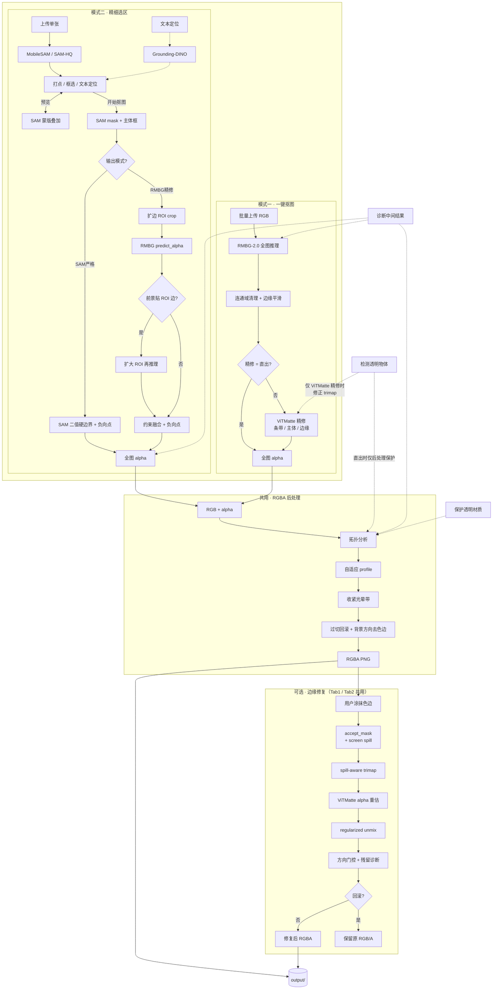

# 全自动抠图工具

> 本地离线抠图工作站：一键批量 + SAM 精细选区 + 涂抹式发丝去色边，数据不出本机。

<!-- 如果有截图/GIF，放在这里效果最佳 -->
<!--  -->

## ✨ 为什么选它

| | 云端工具 | 桌面专业软件 | **本工具** |
|---|---|---|---|
| 部署 | 上传即用 | 安装 | **本地 `python app.py`，打包后双击 exe** |
| 批量 | 有限 | 需录制动作 | **多图拖入自动出图** |
| 去色边 | 少有专业支持 | 手动 | **全自动绿/蓝/红等纯色幕去色边** |
| 选区控制 | 无 | 手动精确 | **点选/框选/文本定位（SAM + Grounding-DINO）** |
| 过切保护 | 无 | 无 | **自动回滚，越修越糟时恢复原图** |
| 数据安全 | 离开本机 | 本地 | **全链路本机推理，无需联网** |

> 发丝、半透明等效果对标商业 SOTA，同时补齐它们普遍缺的本地离线、自动去色边与可控选区。

## 🚀 快速开始

```bash
# 1. 安装依赖
pip install -r requirements.txt -i https://pypi.tuna.tsinghua.edu.cn/simple

# 2. 下载模型（见下方「模型下载」一节）

# 3. 启动
python app.py
# → 浏览器自动打开 http://localhost:18181
```

**打包为 exe（免 Python 环境）：**

```bash
python build.py                  # 完整打包
python build.py --no-models      # 跳过模型，快速迭代
python build.py --clean          # 构建前强制清理
```

产物目录：`dist/全自动抠图/`。若被杀毒拦截，将整个文件夹加入白名单。

## 📖 功能说明

本工具提供两种处理模式，各自得到全图 alpha，**导出前**共用同一套 RGBA 后处理与可选边缘修复。

### 模式一 · 一键抠图

批量上传 → RMBG-2.0 全图推理 → 清理/平滑 → 可选 ViTMatte 精修 → RGBA 后处理 → 导出透明 PNG。

1. 打开 **一键抠图** 标签页，中栏上传或粘贴原图（批量可一次选多张）
2. （可选）勾「检测透明物体」、选精修模型（直出 / Base / MatAny / Small）、勾「保存诊断中间结果」
3. 点击 **开始抠图** → 透明 PNG 存到 `output/`
4. 预览区可 **查看大图** / **下载**；发丝或边缘有背景色残留时点 **边缘修复**

**直出 vs ViTMatte 精修：**

| 主体类型 | 推荐 | 说明 |
|---|---|---|
| 硬边（产品、硬轮廓） | **直出** | RMBG + 后处理，最快，通常已足够 |
| 软边（发丝、毛绒、运动模糊） | **ViTMatte** | 重建 alpha 过渡，收益最大 |

- **变体**：Small（省显存）/ Base（更准）/ MatAny（需额外权重）
- **推理模式**：条带（省显存）/ 主体 / 边缘
- ViTMatte 用模型原生注意力（window+global），不用 strided 近似

### 模式二 · 精细选区

上传单张 → 点选/框选/文本定位选区 → SAM 分割 → 输出模式二选一 → 导出。

1. 打开 **精细选区** 标签页，中栏上传或粘贴单张原图
2. 选 **引擎模式**：**高精度**（SAM-HQ，默认）或 **快速**（MobileSAM）
3. 获取选区（三种可混用），继续打点精修至满意：
   - **直接点图** — 正/负向点选，SAM 实时预览
   - **文本定位** — 输入描述（如 `goose`），DINO 框选 → SAM 分割
   - **自动分割** — SAM 自动列出候选主体，点选 / 排除
   - 打点过程可 **撤销** / **清除标记**
4. 选 **输出模式**：**SAM严格**（二值硬边界 + 负向点，最快，默认）或 **RMBG精修**（SAM 定主体 + ROI 内 RMBG 融合，软边/发丝更好）
5. 点击 **开始抠图** → RGBA 后处理 → 存到 `output/`
6. 预览区可 **查看大图** / **下载**；色边残留时进入 **边缘修复**

**输出模式对比：**

| 输出模式 | 原理 | 适用场景 | 速度 |
|---|---|---|---|
| **SAM严格**（默认） | 纯 SAM 二值硬边界 + 负向点 | 硬边主体、产品图 | ⚡ 最快 |
| **RMBG精修** | SAM 定主体 + ROI 内 RMBG 约束融合 | 发丝、软边、半透明 | 较快 |

> 低显存下 SAM-HQ 与 RMBG 可能同时驻留，建议 ≥8GB 显存或优先 MobileSAM。

### 涂抹式边缘修复（两 Tab 共用）

当发丝边缘 alpha 接近实心但 RGB 仍含背景色残留时，自动 despill 效果有限，可用手动修复：

1. 抠图后右栏出现 **边缘修复** 按钮；进入后用红色画笔涂抹色边区域（可橡皮擦修正）
2. 点击 **应用修复**，系统自动重估发丝 alpha、去色边，残留变差时回滚保护
3. 支持 **撤销**（最多 5 步）/ **重置** / **退出修复**

```
涂抹 → accept_mask (+ screen spill) → spill-aware trimap → ViTMatte 重估 alpha
  → regularized unmix → 方向门控 → 残留诊断 → 安全合并 / 回滚
```

**ViTMatte 变体**：Tab1 跟随「精修模型」（直出时内部回退 Base），Tab2 固定 Base。

### 原图上传（两 Tab 中栏）

- **点击上传** 或 **Ctrl+V 粘贴**（焦点在页面内、不在文本框中）
- **更换图片须先点「清空原图区」** 再重新上传或粘贴
- 一键抠图的 **批量** 为多文件选择，**单张** 支持粘贴

## 🔄 处理流程



**读图说明：**

- **模式一**：直出 = RMBG → 清理/平滑 → 后处理（不跑 ViTMatte / DINO）；ViTMatte 精修则在 RMBG alpha 上生成窄 unknown trimap 再精修。勾「检测透明物体」时，直出仅在后处理加强半透明保护、不跑 DINO，ViTMatte 路径才用 DINO 修正 trimap。
- **模式二**：不走 ViTMatte，输出二选一——SAM严格 或 RMBG精修。
- **共用**：导出前自动 RGB 去色边（按 alpha 外侧背景 seed 估计方向，仅在背景可信且确有残留时修正）；默认单 session 低显存，多人 / 多标签页加 `--multi-session`。

## 🗂 项目结构

```
ai-matting-toolkit/
├── app.py                    # 入口：初始化、Tab1 回调、UI 构建、CLI
├── model_manager.py          # 模型懒加载、设备与路径
├── log.py                    # 日志模块（MATTING_LOG_LEVEL 控制级别）
├── app_logic/
│   ├── tab2.py               # Tab2 后端：SAM 会话、选区、预测、alpha 生成
│   └── refine.py             # 手动边缘修复回调（Tab1 / Tab2 共用）
├── app_ui/
│   ├── layout.py             # CSS / JS + Gradio 组件布局
│   └── events.py             # Tab1 / Tab2 事件绑定
├── engines/                  # 核心推理引擎
│   ├── rmbg2.py              # RMBG-2.0 全图 / ROI alpha
│   ├── vitmatte.py           # ViTMatte 精修与手动修复
│   ├── rgba_postprocess.py   # 拓扑感知 RGBA 后处理（共用出口）
│   ├── rgb_defringe.py       # 背景方向去色边 + screen despill
│   ├── manual_refine.py      # 涂抹式边缘修复管线
│   ├── sam_session.py        # SAM 会话基类：embedding 缓存、预测、自动分割
│   ├── mobile_sam.py         # MobileSAM 加载封装
│   ├── sam_hq.py             # SAM-HQ 加载封装
│   └── grounding_dino.py     # 文本定位 / 透明物体检测
├── scripts/                  # 测试与评测
│   ├── benchmark.py          # 端到端质量回归（LPIPS / SAD 等指标）
│   ├── test_manual_refine.py # 边缘修复回归（18 项合成 case）
│   ├── test_postprocess.py   # RGBA 后处理 + defringe 测试
│   ├── test_rmbg_cleanup.py  # RMBG 连通域清理测试
│   └── test_sam_strict_alpha.py
├── pyinstaller-hooks/        # PyInstaller 自定义 hook
├── models/                   # 权重目录（见下文）
├── output/                   # 导出 PNG 与可选 _debug 诊断
├── build.py                  # PyInstaller 打包脚本
└── _build_spec.py            # 动态生成优化 .spec 文件
```

## 🛠 开发环境

### 系统要求

- **Python** 3.10+
- **GPU**：NVIDIA（推荐，CUDA）/ Apple Silicon（MPS）/ CPU
- **显存**：≥6GB 可运行大部分功能；≥8GB 推荐（SAM-HQ + RMBG 同时驻留时）

### 安装

```bash
pip install -r requirements.txt -i https://pypi.tuna.tsinghua.edu.cn/simple
```

> MobileSAM 需从 GitHub 安装；网络受限可手动下载源码后 `pip install .`

### 模型下载

所有模型放到 `models/` 目录：

```
models/
├── rmbg-2.0/              # RMBG-2.0（必须）
├── vitmatte-base/         # ViTMatte Base（可选，精修用）
├── vitmatte-small/        # ViTMatte Small（可选，省显存）
├── vitmatte-matany/       # ViTMatte MatAny（可选）
├── grounding-dino-tiny/   # Grounding-DINO（可选，文本定位用）
├── mobile_sam/
│   └── mobile_sam.pt      # MobileSAM（必须，快速选区）
└── sam_hq/
    └── sam_hq_vit_l.pth   # SAM-HQ（必须，高精度选区）
```

<details>
<summary><b>一键下载脚本</b></summary>

> 需 [huggingface-cli](https://huggingface.co/docs/huggingface_hub/en/guides/cli) 并已 `huggingface-cli login`。RMBG-2.0 需在 [模型页](https://huggingface.co/briaai/RMBG-2.0) 申请访问。

```bash
# 核心模型
huggingface-cli download briaai/RMBG-2.0 --local-dir models/rmbg-2.0
mkdir -p models/mobile_sam
curl -L -o models/mobile_sam/mobile_sam.pt https://github.com/ChaoningZhang/MobileSAM/raw/master/weights/mobile_sam.pt
huggingface-cli download lkeab/hq-sam sam_hq_vit_l.pth --local-dir models/sam_hq

# 可选：ViTMatte 精修
huggingface-cli download hustvl/vitmatte-base-distinctions-646 --local-dir models/vitmatte-base
huggingface-cli download hustvl/vitmatte-small-distinctions-646 --local-dir models/vitmatte-small

# 可选：文本定位
huggingface-cli download IDEA-Research/grounding-dino-tiny --local-dir models/grounding-dino-tiny
```

GitHub 困难时 MobileSAM 镜像：

```bash
curl -L -o models/mobile_sam/mobile_sam.pt https://ghproxy.com/https://github.com/ChaoningZhang/MobileSAM/raw/master/weights/mobile_sam.pt
```

</details>

<details>
<summary><b>MatAny（可选）</b></summary>

1. 下载 [ViTMatte_B_DIS.pth](https://drive.google.com/file/d/1d97oKuITCeWgai2Tf3iNilt6rMSSYzkW)
2. 放到 `models/vitmatte-matany/`
3. 首次加载自动转换为 transformers 格式

</details>

### 启动参数

| 参数 | 说明 |
|---|---|
| `-p`, `--port` | 监听端口（默认 `18181`） |
| `-q`, `--silent` | 不自动打开浏览器，减少控制台输出 |
| `--multi-session` | 多标签页 SAM 状态隔离；模型更倾向常驻 |
| `--max-sam-sessions` | 多 session 下 SAM 缓存上限（默认 `8`，LRU 回收） |
| `--model-concurrency` | GPU 推理并发槽（默认单 session `1`，多 session `2`） |
| `--queue-size` | 等待队列长度（默认 `32`） |
| `--feedback-url` | 反馈问题的超链接地址，显示在标题旁 |

**多人使用示例：**

```bash
python app.py --multi-session --max-sam-sessions 8 --model-concurrency 2 --queue-size 32
```

### 环境变量

| 变量 | 默认 | 说明 |
|---|---|---|
| `MATTING_PRELOAD_RMBG` | `1` | 启动时后台预热 RMBG-2.0；设为 `0` 关闭 |
| `MATTING_AGGRESSIVE_UNLOAD` | 单 session `1` / 多 session `0` | 任务间更积极卸载未用模型以省显存 |
| `MATTING_STARTUP_LOG` | `1` | 打印分阶段启动耗时 |
| `MATTING_LOG_LEVEL` | `INFO` | 日志级别（`DEBUG` / `INFO` / `WARNING`） |
| `MANUAL_REFINE_DEBUG` | 未设置 | 设为非空值时，边缘修复打印详细诊断 |

### 测试

```bash
# RGBA 后处理测试（无需 GPU，可先验证基础链路）
python scripts/test_postprocess.py

# 边缘修复回归测试（需 ViTMatte，GPU 约 0.5s/case，18 项合成 case）
python scripts/test_manual_refine.py
python scripts/test_manual_refine.py --debug-dir output/_test_manual  # 保存诊断图

# 端到端质量回归（覆盖 Tab1 + Tab2 双引擎，含 LPIPS / SAD 等指标）
python scripts/benchmark.py save --input test_images      # 首次：保存基线
python scripts/benchmark.py compare --input test_images   # 改动后：对比基线
```

## 🔧 技术栈

| 组件 | 模型 / 模块 | 用途 |
|---|---|---|
| 自动抠图 | [RMBG-2.0](https://huggingface.co/briaai/RMBG-2.0) | 模式一全图；模式二 ROI alpha |
| 边缘精修 | [ViTMatte](https://huggingface.co/hustvl/vitmatte-base-distinctions-646) | 仅模式一可选（Small/Base/MatAny） |
| 输出净化 | `engines/rgba_postprocess` + `engines/rgb_defringe` | 两模式共用：拓扑收边、背景方向去色边、screen despill |
| 手动修复 | `engines/manual_refine` | 两 Tab 共用：screen chroma 诊断、ViTMatte alpha 重估、unmix 去色边、残留回滚 |
| 快速选区 | [MobileSAM](https://github.com/ChaoningZhang/MobileSAM) | 模式二交互与先验 |
| 高精度选区 | [SAM-HQ](https://github.com/SysCV/sam-hq) | 模式二高精度选区 |
| 文本定位 | [Grounding-DINO](https://huggingface.co/IDEA-Research/grounding-dino-tiny) | 模式二框选；模式一透明检测时修正 trimap |
| Web UI | [Gradio 6](https://gradio.app/) | 浏览器界面、队列与并发 |

## 📋 许可证

各模型遵循其原始许可证，请参阅对应官方仓库。
