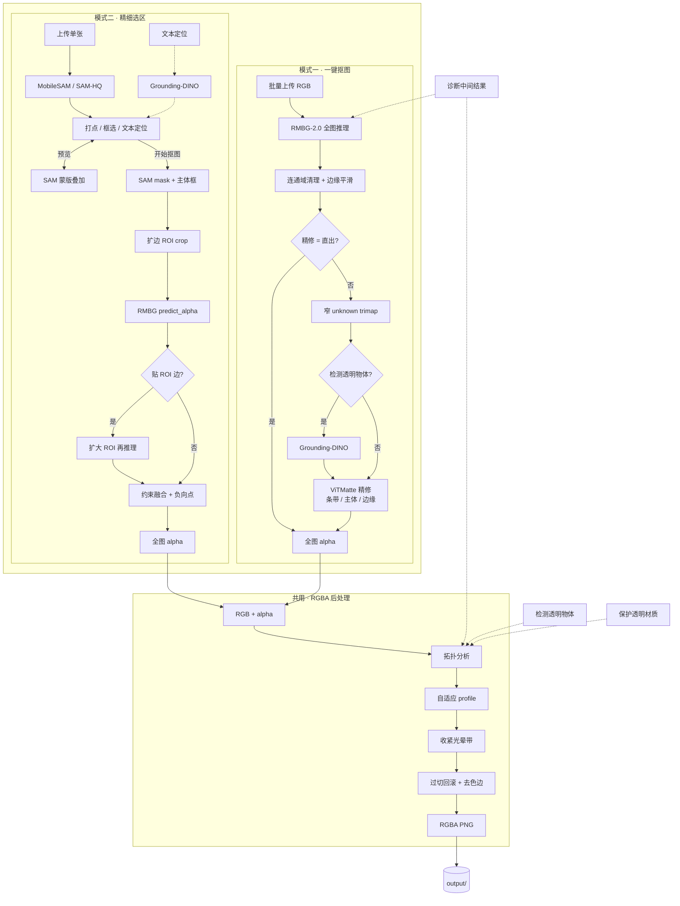

# 全自动抠图工具

一键抠图 + 交互式精细选区，双击即用。

## 功能特性

- **一键批量抠图** — 拖入图片自动去背景，支持批量处理
- **交互式精细选区** — SAM 实时预览选区；生成时与 RMBG-2.0 在 ROI 内融合精细 alpha
- **文本智能定位** — 输入描述自动框选物体（Grounding-DINO，支持中英文）
- **透明物体处理** — 专门优化玻璃、水滴、灯泡等半透明材质
- **自动输出净化** — 默认进行自适应光晕清理、边缘去色和细节保护
- **双引擎可选** — MobileSAM（快速）/ SAM-HQ（高精度）
- **ViTMatte 精修** — 可选边缘精修，对发丝、毛绒等复杂边缘做 alpha 级优化

## 快速开始（使用打包版本）

1. 双击 `全自动抠图.exe` 启动
2. 程序自动打开浏览器界面
3. 如被杀毒软件拦截，请将整个文件夹添加到白名单

## 功能说明

### 处理流程

两条路径在汇合前各自产生全图 alpha；**导出 PNG 前**共用同一套 RGBA 后处理。启动时默认后台预热 RMBG-2.0（`MATTING_PRELOAD_RMBG=0` 可关闭）。



- 模式二**不走 ViTMatte**；低显存下 SAM-HQ 与 RMBG 可能同时驻留，建议 ≥8GB 显存或优先 MobileSAM。
- 模式一勾选「检测透明物体」时，后处理会保护半透明区域（即使直出）；模式二由「保护透明/半透明材质」单独控制。
- 默认按单 session 低显存模式运行；需要多人/多标签页隔离时加 `--multi-session`，每个浏览器 session 会有独立的 SAM predictor、图像 embedding 和点击先验，默认最多保留 8 个 SAM session。

### 模式一：一键抠图

1. 点击 **一键抠图** 标签页
2. 在原图区拖入单张或多张图片
3. （可选）勾选「检测透明物体」处理玻璃/水滴等材质
4. （可选）选择精修模型（默认直出，可选 Small/Base/MatAny）
5. （可选）勾选「保存诊断中间结果」查看 alpha、光晕、边色污染等终端指标
6. 点击 **开始抠图**
7. 结果自动保存到 `output/` 文件夹（透明背景 PNG）

### 直出 vs ViTMatte 精修：怎么选

| 主体类型 | 推荐 |
|---|---|
| 硬边主体（产品、物体、硬轮廓人像） | **直出**（默认）。干净利落的硬边就是最优解，速度最快 |
| 软边主体（发丝、毛绒、运动模糊、半透明） | **ViTMatte 精修**。能在过渡区重建 alpha 软渐变；直出在这类边缘会切出硬边/锯齿 |

要点：

- **直出** = RMBG 分割 + 自适应后处理（光晕清理 / 边缘去色 / 细节保护）。对硬边主体已经足够，无需 ViTMatte。
- **ViTMatte 在硬边主体上的天花板只是「追平直出」**：边缘已经是硬边时，再做 alpha 精修最多打平，过度还会留下半透明光晕。所以硬边场景默认直出即可，ViTMatte 的价值只在软边/细节主体上体现。
- **变体取舍**：`Small`（省显存、快）/ `Base`（更准、更慢更吃显存）/ `MatAny`（需额外权重，对齐 Matte-Anything）。
- **推理模式**：`条带`（省显存，只处理 unknown 带）/ `主体`（主体 crop）/ `边缘`（边缘 crop，边最锐）。
- ViTMatte 一律使用模型**原生注意力（window+global）**，质量最佳；小图上比旧的 strided 省显存近似既更锐也更快。

### 模式二：精细选区

1. 点击 **精细选区** 标签页
2. 在画布区上传一张图片
3. 选择点击模式：**正向选取**（保留）/ **负向排除**（去掉）
4. 选择引擎：**MobileSAM**（快速）/ **SAM-HQ**（高精度）
5. 在图片上点击打点，红色蒙版实时显示选区（仅 SAM，尚未调用 RMBG）
6. （可选）启用文本定位，输入描述自动框选（Grounding-DINO → SAM）
7. （可选）勾选「保护透明/半透明材质」— 后处理时保留物体内部的软 alpha，不当作背景光晕收掉
8. （可选）勾选「保存诊断中间结果」查看后处理指标和中间图
9. 满意后点击 **开始抠图**（SAM + RMBG 融合 → RGBA 后处理 → 保存）

## 开发环境

### 系统要求

- Python 3.10+
- NVIDIA GPU（推荐，支持 CUDA）/ Apple Silicon（MPS）/ CPU

### 安装依赖

```bash
pip install -r requirements.txt -i https://pypi.tuna.tsinghua.edu.cn/simple
```

### 运行

```bash
python app.py
```

默认在后台线程预热 RMBG-2.0，浏览器打开后首帧抠图更快。关闭预热：

```bash
# Windows
set MATTING_PRELOAD_RMBG=0 && python app.py

# Linux / macOS
MATTING_PRELOAD_RMBG=0 python app.py
```

> MobileSAM 需要从 GitHub 安装，如网络受限可手动下载源码后 `pip install .`

### 下载模型

所有模型放到 `models/` 目录下，结构如下：

```
models/
├── rmbg-2.0/              # 自动抠图模型
├── vitmatte-base/         # 边缘精修模型（Base）
├── vitmatte-small/        # 边缘精修模型（Small，省显存）
├── vitmatte-matany/       # 边缘精修模型（MatAny，需额外权重）
├── grounding-dino-tiny/   # 文本定位模型
├── mobile_sam/            # 快速选区模型
│   └── mobile_sam.pt
└── sam_hq/                # 高精度选区模型
    └── sam_hq_vit_l.pth
```

#### 一键下载全部模型

> **前置条件**：已安装 [huggingface-cli](https://huggingface.co/docs/huggingface_hub/en/guides/cli)（`pip install huggingface_hub`），并已登录 HuggingFace（`huggingface-cli login`）。RMBG-2.0 需先在 [模型页面](https://huggingface.co/briaai/RMBG-2.0) 申请访问权限（通常秒批）。

```bash
# RMBG-2.0（自动抠图）
huggingface-cli download briaai/RMBG-2.0 --local-dir models/rmbg-2.0

# ViTMatte-Base（边缘精修）
huggingface-cli download hustvl/vitmatte-base-distinctions-646 --local-dir models/vitmatte-base

# ViTMatte-Small（边缘精修，省显存）
huggingface-cli download hustvl/vitmatte-small-distinctions-646 --local-dir models/vitmatte-small

# Grounding-DINO（文本定位）
huggingface-cli download IDEA-Research/grounding-dino-tiny --local-dir models/grounding-dino-tiny

# SAM-HQ（高精度选区）
huggingface-cli download lkeab/hq-sam sam_hq_vit_l.pth --local-dir models/sam_hq

# MobileSAM（快速选区）
mkdir -p models/mobile_sam
curl -L -o models/mobile_sam/mobile_sam.pt https://github.com/ChaoningZhang/MobileSAM/raw/master/weights/mobile_sam.pt
```

如果 GitHub 访问困难，MobileSAM 可用镜像：

```bash
curl -L -o models/mobile_sam/mobile_sam.pt https://ghproxy.com/https://github.com/ChaoningZhang/MobileSAM/raw/master/weights/mobile_sam.pt
```

#### MatAny 模型（可选）

MatAny 需要额外的 detectron2 权重：

1. 下载 [ViTMatte_B_DIS.pth](https://drive.google.com/file/d/1d97oKuITCeWgai2Tf3iNilt6rMSSYzkW)
2. 放到 `models/vitmatte-matany/` 目录
3. 首次加载自动转换为 transformers 格式，之后秒加载

### 打包为 exe

```bash
build.bat
```

PyInstaller 的中间缓存写在项目根的 `.pyi-build/`，打包结束会自动删除；项目根目录只应留下 `dist/`。若仍有旧的 `build/`，可安全手动删除。

**只需分发一个文件夹**：`dist/全自动抠图/`。其中包含 `全自动抠图.exe`、`_internal/`（依赖库，勿删）以及自动复制的 `models/`（若项目根目录已有模型）。不要单独拷贝 `build/` 里的 exe。

打包时通过 `pyinstaller-hooks/hook-kornia.py` 将 kornia 以 **源码（.py）** 形式打入包内，避免 `torch.jit.script` 在 exe 中因读不到源码而失败（与 `python app.py` 行为一致）。

## 常见问题

**Q: 启动后浏览器没有自动打开？**
A: 手动访问 http://127.0.0.1:18181（若用 `-p` 指定了端口，以实际端口为准）

**Q: 如何给局域网多人访问？**
A: 当前默认只启动本机服务 `127.0.0.1:18181`，不带公网分享和鉴权参数。让别人临时使用时，建议让对方在本机浏览器/远程桌面里打开；如需多标签页/多人状态隔离，启动时加 `--multi-session`，超出 `--max-sam-sessions` 后回收最久未用的 SAM 缓存。

**Q: 如何退出程序？**
A: 关闭弹出的黑色控制台窗口，或在其中按 `Ctrl+C`。仅关浏览器标签不会结束服务。

**Q: 被杀毒软件拦截？**
A: 将整个文件夹添加到杀毒软件白名单

**Q: 处理速度很慢？**
A: 首次使用某个模式需要加载模型，之后会很快。建议使用 NVIDIA GPU。

**Q: 支持哪些图片格式？**
A: JPG、PNG、BMP、WEBP、TIFF

## 技术栈

| 组件 | 模型 / 模块 | 用途 |
|---|---|---|
| 自动抠图 | [RMBG-2.0](https://huggingface.co/briaai/RMBG-2.0) | 全图/ROI alpha 推理 |
| 边缘精修 | [ViTMatte](https://huggingface.co/hustvl/vitmatte-base-distinctions-646) | 模式一可选 unknown 带精修（Small/Base/MatAny） |
| 输出净化 | `engines/rgba_postprocess` | 拓扑感知收边、去色边、发丝/半透明保护 |
| 快速选区 | [MobileSAM](https://github.com/ChaoningZhang/MobileSAM) | 模式二交互预览 + 主体先验 |
| 高精度选区 | [SAM-HQ](https://github.com/SysCV/sam-hq) | 模式二高精度选区 |
| 文本定位 | [Grounding-DINO](https://huggingface.co/IDEA-Research/grounding-dino-tiny) | 文本框选（模式二 / 模式一透明 trimap） |
| Web UI | [Gradio 6](https://gradio.app/) | 浏览器界面 |

## 许可证

本项目使用的模型各自遵循其原始许可证，请参阅各模型的官方仓库了解详情。
